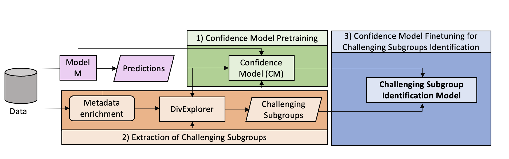

# Leveraging CMs for Identifying Problematic Subgroups
This repo contains the code for "Leveraging Confidence Models for Identifying Challenging Data Subgroups in Speech Models".

Our pipeline is shown here and comprises three main steps:
1) Confidence Model (CM) Training: We pretrain a CM tailored to the task under analysis. The CM serves to capture valuable information regarding potential sources of errors in the model M.

2) (Prior) Extraction of Problematic Subgroups: We extract problematic subgroups from model M using a dataset enriched with relevant metadata, including demographics, speech-related, and dataset- or task-dependent information (see discussion below for more information). We identify problematic subgroups through DivExplorer, following the approach presented [here](https://ieeexplore.ieee.org/abstract/document/10095284).

3) Learning the Problematic Subgroup Identification Model: We fine-tune the CM-based model to predict, for each utterance, the specific problematic subgroup to which it belongs to. By leveraging the encoded information from the CM, this identification model gains insights into potential challenges associated with each utterance.

    

## Getting Started

### Data
We do not include the datasets used in the paper as they are publicly available and downloadable from the respective authors. To make it work, you should put data files under data.

### Python Environment
Our code was tested on Python 3.11.2. To make it work, you will need:
- a working environment with the libraries listed in requirements.txt;
- a functioning torch installation in the same environment.

### Running the Experiments
Use the `cm_fsc.ipynb` notebook to reproduce the experiments on FSC, and `cm_librispeech.ipynb` to replicate the ones on LibriSpeech.

## Metadata Extraction
To extract the problematic subgroups, we adopt the **DivExplorer** method, following the approach presented [here](https://ieeexplore.ieee.org/abstract/document/10095284).
DivExplorer, given a set of interpretable metadata that describes utterances, extract all subgroups that are adequately represented in the data and compute how their performance diverges from the overall one on the entire dataset, denoted as *divergence*. 

We first enrich the dataset with metadata to enable extraction. Specifically, we use demographic, speech, and dataset- and task-specific metadata. 
The selection of adequately represented subgroups denoted as frequent, is based on a frequency threshold.
- *Speaker Demographics*: we consider the self-declared gender and age range for FSC, and the gender only for LibriSpeech.
- *Speaking and recording conditions*: we consider the duration of silences and the duration of the audio sample (total and trimmed without initial silences), the number of words, and the speaking rate (word per second).
- *E2E Task*: for FSC only, we consider the three target slots to evaluate whether specific intents are particularly challenging.
We discretize continuous metadata in three ranges using frequency-based discretization, and we rename the ranges as ‘low’, ‘medium’, and ‘high’. 

The selection of adequately represented subgroups, denoted as *frequent*, is based on a frequency threshold. In our analysis, we explore subgroups corresponding to more than one hundred utterances.

## Features employed
We use the following features to train the confidence models:
- *Acoustic embeddings*: we use the [wav2vec2](https://arxiv.org/abs/2006.11477) embeddings extracted from the audio signal. Specifically, we use the [HuggingFace](https://huggingface.co/) implementation of the [wav2vec2-base](https://huggingface.co/facebook/wav2vec2-base) model, and we extract the embeddings from the hidden layers of the model.
We empirically observed that the average of the embeddings of the last layer provides the best results, even if the embeddings of the other layers are also informative and can be used to train the confidence models. 
- *n-best list*: For LibriSpeech, we use the n-best list of the model, i.e., the list of the n most probable hypotheses for each utterance. 
- *Output probabilities*: for FSC we use the output probabilities of the model for each class (for action, obkect, and location). For LibriSpeech, we use the output probabilities of the model for each word in the n-best list.
- *Speech metadata*: we use the metadata extracted from the audio signal, including the number of words, number of pauses, and speaking rate (word per second).

## Dataset Characteristics

The following table reports the number of utterances and speakers for each dataset and split.

| DS  |     | Train | Dev | Test |
| --- | --- | ---   | --- | ---  |
| FSC | Utterances   Speakers |  23,132   77 | 3,118   10 | 3,793   10 |
| LibriSpeech | Utterances   Speakers |  104,014   921 | 2,703   40 | 2,620   40 |

## License
The code is released under the Apache 2.0 license. See LICENSE for more information.

## Contact 
For any questions, please contact [Alkis Koudounas](mailto:alkis.koudounas@polito.it).
